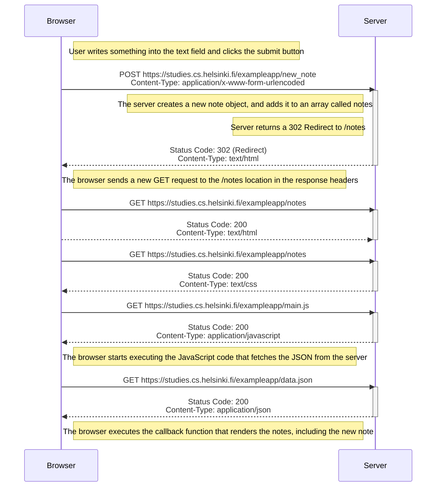

```mermaid
sequenceDiagram
    participant b as Browser
    participant s as Server

    Note right of b: User writes something into the text field and clicks the submit button

    b->>s: POST https://studies.cs.helsinki.fi/exampleapp/new_note<br/>Content-Type: application/x-www-form-urlencoded
    activate s
    Note left of s: The server creates a new note object, and adds it to an array called notes
    Note left of s: Server returns a 302 Redirect to /notes
    s-->>b: Status Code: 302 (Redirect)<br/>Content-Type: text/html
    deactivate s

    Note right of b: The browser sends a new GET request to the /notes location in the response headers
    b->>s: GET https://studies.cs.helsinki.fi/exampleapp/notes
    activate s
    b-->>s: Status Code: 200<br/>Content-Type: text/html
    deactivate s

    b->>s: GET https://studies.cs.helsinki.fi/exampleapp/notes
    activate s
    s-->>b: Status Code: 200<br/>Content-Type: text/css
    deactivate s

    b->>s: GET https://studies.cs.helsinki.fi/exampleapp/main.js
    activate s
    s-->>b: Status Code: 200<br/>Content-Type: application/javascript
    deactivate s

    Note right of b: The browser starts executing the JavaScript code that fetches the JSON from the server

    b->>s: GET https://studies.cs.helsinki.fi/exampleapp/data.json
    activate s
    s-->>b: Status Code: 200<br/>Content-Type: application/json
    deactivate s

    Note right of b: The browser executes the callback function that renders the notes, including the new note
```
