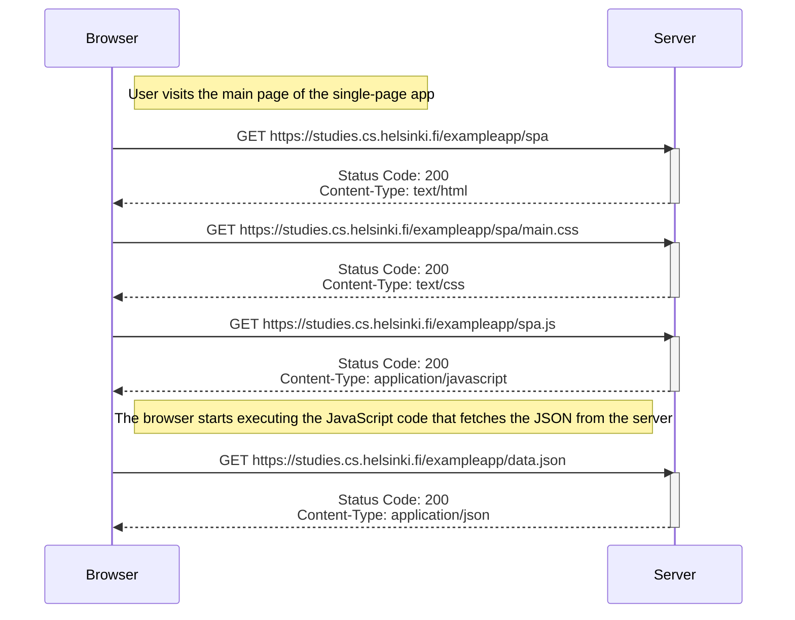

```mermaid
sequenceDiagram
    participant b as Browser
    participant s as Server

    Note right of b: User visits the main page of the single-page app 

    b->>s: GET https://studies.cs.helsinki.fi/exampleapp/spa
    activate s
    s-->>b: Status Code: 200<br/>Content-Type: text/html
    deactivate s

    b->>s: GET https://studies.cs.helsinki.fi/exampleapp/spa/main.css
    activate s
    s-->>b: Status Code: 200<br/>Content-Type: text/css
    deactivate s

    b->>s: GET https://studies.cs.helsinki.fi/exampleapp/spa.js
    activate s
    s-->>b: Status Code: 200<br/>Content-Type: application/javascript
    deactivate s

    Note right of b: The browser starts executing the JavaScript code that fetches the JSON from the server

    b->>s: GET https://studies.cs.helsinki.fi/exampleapp/data.json
    activate s
    s-->>b: Status Code: 200<br/>Content-Type: application/json
    deactivate s
```
