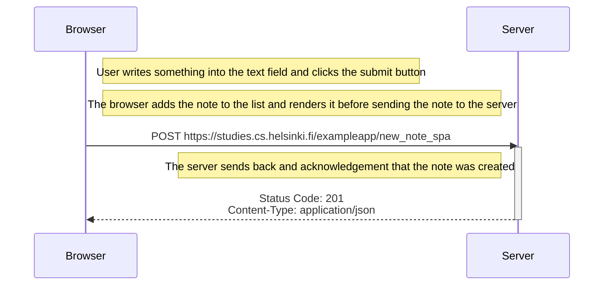

```mermaid
sequenceDiagram
    participant b as Browser
    participant s as Server

    Note right of b: User writes something into the text field and clicks the submit button

    Note right of b: The browser adds the note to the list and renders it before sending the note to the server

    b->>s: POST https://studies.cs.helsinki.fi/exampleapp/new_note_spa
    activate s
    Note left of s: The server sends back and acknowledgement that the note was created
    s-->>b: Status Code: 201<br/>Content-Type: application/json
    deactivate s

```
